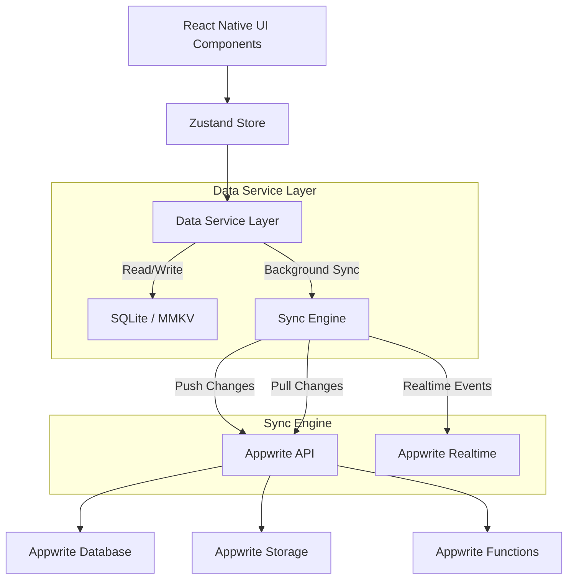

# 🏗️ InvoiceFlow - Technical Blueprint & Architecture

## 1. System Overview

**InvoiceFlow** is a React Native-based mobile billing and invoicing application designed for SMEs. It utilizes a **Offline-First** architecture, ensuring full functionality without internet access, syncing data to **Appwrite** when connectivity is restored.

### Tech Stack

- **Frontend**: React Native (Expo SDK), TypeScript
- **State Management**: Zustand (Global Store), TanStack Query (Server State)
- **Local Database**: Expo SQLite (Structured Data), MMKV (Key-Value Storage/Generic Settings)
- **Backend**: Appwrite (Self-hosted or Cloud)
- **Functions**: Appwrite Functions (Node.js runtime)
- **PDF Engine**: `expo-print` + `expo-sharing`

---

## 2. Feature Breakdown

### 🟢 Basic Features (MVP)

1.  **Auth**: Phone OTP & Email/Password via Appwrite Auth.
2.  **Business Profile**: Logo, GSTIN, Signature, Address.
3.  **Customer Management**: CRUD with search & validation.
4.  **Product Inventory**: Stock tracking, Categories, Tax rates.
5.  **Invoicing**:
    - Dynamic tax calculation (SGST/CGST/IGST).
    - Discount logic (Flat/Percentage).
    - PDF Generation with QR Code (UPI Standard).
6.  **Offline Core**: Automatic local persistence updates.

### 🟡 Advanced Features

1.  **Multi-Business Support**: Context switching based on `businessId`.
2.  **RBAC (Role-Based Access)**: Owner vs Staff permissions.
3.  **Inventory Sync**: Cloud functions to deduct stock on invoice generation.
4.  **Subscription System**: In-App Purchases (RevenueCat or Native) validated via Appwrite Functions.

---

## 3. Application Architecture

The app follows a **Repository Pattern** to abstract data sources (Local vs Cloud).



### Folder Structure

```text
src/
├── app/                 # Expo Router (Navigation)
│   ├── (auth)/          # Login/Signup screens
│   ├── (main)/          # Dashboard, Invoicing, etc.
│   └── _layout.tsx
├── components/          # Reusable UI components
├── services/
│   ├── appwrite.ts      # Appwrite SDK config
│   ├── database/        # SQLite migrations & queries
│   ├── sync/            # Conflict resolution & queue logic
│   └── api/             # Appwrite API wrappers
├── store/               # Zustand stores
├── types/               # TypeScript interfaces & Schema
├── utils/               # PDF generators, Formatters
└── assets/              # Static images/fonts
```

---

## 4. Database Schema

We use a relational structure in Appwrite (via Relationships) and emulate it in SQLite.

### Collections

#### `users` (Appwrite Auth Preferences / Custom Collection)

- `userId` (String, PK)
- `phone` (String)
- `activeBusinessId` (String, FK)

#### `businesses`

- `$id`: string (PK)
- `ownerId`: string (index)
- `name`: string
- `gstin`: string
- `address`: string
- `logoFileId`: string (Appwrite Storage ID)
- `planType`: enum ('free', 'pro', 'enterprise')
- `createdAt`: datetime

#### `customers`

- `$id`: string
- `businessId`: string (index, Permission scope)
- `name`: string
- `phone`: string
- `city`: string
- `balance`: float
- `updatedAt`: datetime (For sync)

#### `products`

- `$id`: string
- `businessId`: string (index)
- `name`: string
- `price`: float
- `stock`: integer
- `taxRate`: float
- `unit`: string (kg, pcs, ltr)

#### `invoices`

- `$id`: string
- `businessId`: string (index)
- `customerId`: string (FK)
- `invoiceNumber`: integer (Auto-increment per business)
- `date`: datetime
- `totalAmount`: float
- `status`: enum ('paid', 'unpaid', 'partial')
- `pdfUrl`: string (optional)
- `items`: JSON String (Stores snapshot of items to preserve history if product changes)

#### `sync_queue` (Local Only - SQLite)

- `id`: integer (PK)
- `collection`: string
- `documentId`: string
- `operation`: enum ('create', 'update', 'delete')
- `payload`: JSON
- `timestamp`: integer

---

## 5. Offline-Sync Strategy

We implement a **"Last Write Wins"** strategy with a local operation queue.

### 1. The Local-First Flow

1.  User creates an Invoice.
2.  App writes directly to **SQLite**.
3.  App adds a record to `sync_queue` table (Operation: `create`).
4.  UI updates immediately.

### 2. The Sync Process (Background Task)

1.  **Network Detected**: `NetInfo` triggers the sync service.
2.  **Push Phase**:
    - Fetch all pending tasks from `sync_queue`.
    - Iterate and execute Appwrite API calls (batching where possible).
    - On success: Delete from `sync_queue`.
    - On failure: Retry with exponential backoff.
3.  **Pull Phase**:
    - Fetch documents from Appwrite where `updatedAt > lastSyncTimestamp`.
    - Upsert fetched documents into SQLite.
    - Update `lastSyncTimestamp`.

### 3. Realtime Updates

- Subscribe to Appwrite Realtime channels for the active `businessId`.
- On event (create/update/delete), update local SQLite and refresh UI.

---

## 6. Security Model

### Authentication

- **JWT**: Appwrite manages sessions.
- **Local**: Biometric lock (FaceID/TouchID) for app entry.

### Data Access (Appwrite Permissions)

- **Level 1 (User)**: `User` can only read/write their own objects.
- **Level 2 (Business)**: Uses **Team** logic.
  - Each Business is a "Team".
  - Owner has `owner` role.
  - Staff has `staff` role.
- **Document Permissions**:
  - `businesses`: `read("team:business_id")`, `write("team:business_id/owner")`
  - `invoices`: `read("team:business_id")`, `write("team:business_id/staff")`

---

## 7. Scalability & Backups

### Database Indexing

- Indexes on `businessId` and `updatedAt` are critical for sync performance.
- Full-text search index on `customer.name` and `product.name`.

### Appwrite Functions (Node.js)

1.  **`func-generate-report`**: Triggered via cron (1st of month). Aggregates invoice totals and emails PDF.
2.  **`func-backup`**: Exports business data to JSON, encrypts, and saves to a dedicated Storage Bucket.

### API Rate Limiting

- Implement leaky bucket algorithm in Appwrite Functions if exposing custom endpoints.
- Native Appwrite rate limits apply to standard API calls.
